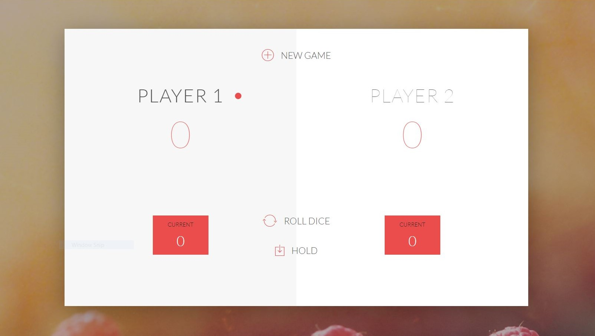

## A-Javascript-based-game

This is a simple dice game build on javascript.

    

## Build ups

This application is very simple to understand, though a little bit of Javascript knowledge is required.
_I highly recommend you to look for **DOM (Document Object Model)** in javascript to understand code better._

Here we have used different javascript tools and functions like:
- DOM manipulation
- funtions like getElementById() and querySelector()
- Event hanlders funtions like eventListener() etc.,

SasukeUchiha7 &copy; Apil Thapa
